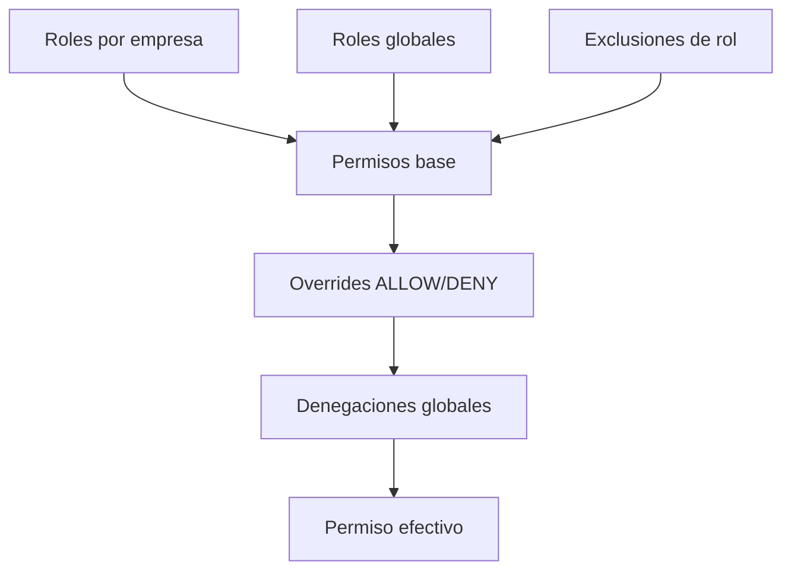

# 🛠️ Manual Tecnico - Seguridad y Permisos

## 🎯 Autenticacion
Endpoints clave:
- `POST /auth/login`
- `POST /auth/refresh`
- `POST /auth/logout`
- `GET /auth/me`
- `POST /auth/switch-company`

Mecanismo:
- Access token y refresh token en cookies httpOnly.
- CSRF token separado.
- Refresh token rotado y almacenado con hash.

## 🎯 Autorizacion por contexto
- Cada request se valida por permiso requerido.
- Permisos dependen de `usuario + empresa + app`.
- Cambio de empresa recalcula permisos.

## 🎯 Modelo de control de acceso

## 🎯 Seguridad de datos sensibles
En empleado se cifra:
- Identificacion y datos personales.
- Contacto sensible.
- Datos salariales y de pago.

Adicional:
- Se almacenan hashes para comparacion de duplicados (email/cedula).

## 🎯 Permisos criticos de referencia
- Empleados: `employee:*`, `employee:view-sensitive`
- Empresas: `company:*`
- Planilla: `payroll:*`
- Configuracion: `config:*`
- Acciones de personal: `hr-action-*`

## 🔗 Ver tambien
- [Matriz de permisos canonica](../16-enterprise-operacion/01-MATRIZ-PERMISOS-CANONICA.md)
- [API y contratos](./04-API-CONTRATOS.md)

