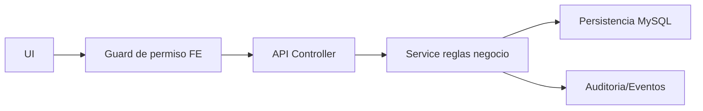

# 🛠️ Manual Tecnico - Operacion por Modulo

## 🎯 Objetivo
Dar a ingenieria una vista unificada de como opera cada modulo y donde tocar cuando hay incidentes.

| Modulo | Backend principal | Frontend principal | Riesgo operativo |
|---|---|---|---|
| Auth/Sesion | `auth.controller.ts`, `auth.service.ts` | `LoginPage`, `useSessionRestore` | Sesiones invalidas/permisos stale |
| Empresas | `companies.controller.ts`, `companies.service.ts` | `CompaniesManagementPage` | Bloqueos por planillas activas |
| Empleados | `employees.controller.ts`, `employees.service.ts`, workflow creacion | `EmployeesListPage`, `EmployeeCreatePage` | Exposicion de datos sensibles |
| Config acceso | `config-access.controller.ts` | `UsersManagementPage`, `RolesManagementPage`, `PermissionsAdminListPage` | Escalada de privilegios |
| Planilla | `payroll.controller.ts`, `payroll.service.ts` | `PayrollGeneratePage` | Transiciones de estado invalidas |
| Acciones personal | `personal-actions.controller.ts`, `personal-actions.service.ts` | Paginas por tipo de accion | Consumo incorrecto en nomina |
| Parametros nomina | articulos/movimientos/feriados controllers | paginas payroll params | Configuracion inconsistente |
| Traslado interempresa | `intercompany-transfer.controller.ts` | `IntercompanyTransferPage` | Reasociacion incompleta |

## 🎯 Cadena tecnica end-to-end

## 🔗 Ver tambien
- [Matriz CRUD por modulo](./08-MATRIZ-CRUD-POR-MODULO.md)
- [Manejo de incidentes](./09-MANEJO-INCIDENTES-FUNCIONALES.md)

