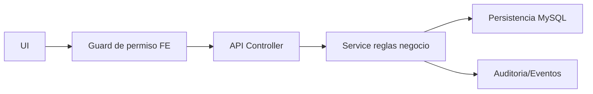
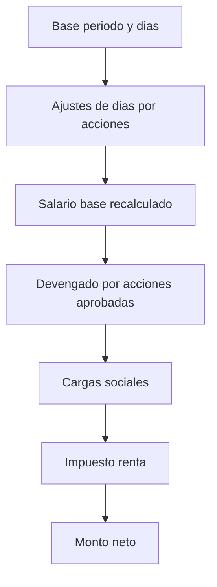

# 🛠️ Manual Tecnico - Operacion por Modulo

## 🎯 Objetivo
Dar a ingenieria una vista unificada de como opera cada modulo y donde tocar cuando hay incidentes.

| Modulo | Backend principal | Frontend principal | Riesgo operativo |
|---|---|---|---|
| Auth/Sesion | `auth.controller.ts`, `auth.service.ts` | `LoginPage`, `useSessionRestore` | Sesiones invalidas/permisos stale |
| Empresas | `companies.controller.ts`, `companies.service.ts` | `CompaniesManagementPage` | Bloqueos por planillas activas |
| Empleados | `employees.controller.ts`, `employees.service.ts`, workflow creacion | `EmployeesListPage`, `EmployeeCreatePage` | Exposicion de datos sensibles |
| Config acceso | `config-access.controller.ts` | `UsersManagementPage`, `RolesManagementPage`, `PermissionsAdminListPage` | Escalada de privilegios |
| Planilla | `payroll.controller.ts`, `payroll.service.ts` | `PayrollGeneratePage` | Transiciones de estado invalidas |
| Acciones personal | `personal-actions.controller.ts`, `personal-actions.service.ts` | Paginas por tipo de accion | Consumo incorrecto en nomina |
| Parametros nomina | articulos/movimientos/feriados controllers | paginas payroll params | Configuracion inconsistente |
| Traslado interempresa | `intercompany-transfer.controller.ts` | `IntercompanyTransferPage` | Reasociacion incompleta |

## 🎯 Cadena tecnica end-to-end

## 🔗 Ver tambien
- [Matriz CRUD por modulo](./08-MATRIZ-CRUD-POR-MODULO.md)
- [Manejo de incidentes](./09-MANEJO-INCIDENTES-FUNCIONALES.md)

## 🎯 Regla tecnica critica - Modulo Planilla
- En `payroll.service.ts` el recalc de tabla debe incluir acciones `APPROVED`:
  - no asociadas (`idCalendarioNomina IS NULL`)
  - y asociadas a la planilla actual (`idCalendarioNomina = payroll.id`)

Si no se cumple esta regla, puede pasar este incidente:
- La accion se ve `Aprobada` en el detalle.
- Pero la fila principal del empleado no cambia en bruto/devengado/neto.
- En la tabla de planilla deben mostrarse solo acciones en rango y estado:
  - `Pendiente Supervisor`
  - `Pendiente RRHH`
  - `Aprobada`

## 🧮 Formula tecnica consolidada - Planilla
Flujo de calculo por empleado (orden):

| Campo | Formula tecnica |
|---|---|
| `dias` | `dias_periodo` ajustado por ingreso en periodo, override por renuncia/despido y resta por: ausencia no remunerada, licencia no remunerada, incapacidad, vacaciones. |
| `salarioBrutoPeriodo` | No por horas: `salarioBase * (diasLaborados / 30)`. |
| `totalBruto` | `salarioBrutoPeriodo + ingresosAccionesAprobadas`. |
| `cargasSociales` | `sum(totalBruto * porcentaje_carga_social_activa)`. |
| `impuestoRenta` | Tramos progresivos, menos creditos (`hijos`, `conyuge`), quincenal solo segunda quincena y acumulando base de quincena anterior. |
| `totalDeducciones` | `deduccionesAccionesAprobadas + cargasSociales + impuestoRenta`. |
| `totalNeto` | `totalBruto - totalDeducciones`. |

### 📌 Reglas por tipo de accion aprobada
| Tipo accion | Dias | Monto en devengado |
|---|---|---|
| `ausencia` | Resta solo no remunerada | No suma monto |
| `licencia` | Resta solo no remunerada | Suma solo lineas remuneradas |
| `incapacidad` | Resta dias | Suma solo monto de lineas `CCSS` |
| `vacaciones` | Resta dias | Recalcula monto por dias de vacaciones |
| `aumento` | No afecta dias | Suma monto de lineas |
| `bonificacion` | No afecta dias | Suma monto de lineas |
| `hora_extra` | No afecta dias | Suma monto de lineas |
| `retencion`/`descuento` | No afecta dias | Va a deduccion, no a devengado |

### 🖥️ UX de trazabilidad en tabla de acciones
En `PayrollGeneratePage` el detalle expandido agrega lectura funcional:
- `Impacto` (Suma/Resta/Solo dias/Mixto).
- `Afecta dias` (si modifica dias laborados).
- `Aplicada al calculo` (si/no segun estado y tipo de fila).
- Tooltip `Como impacta?` por cada tipo de accion para usuarios no tecnicos.

