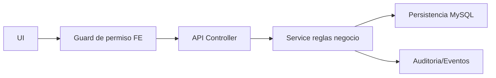
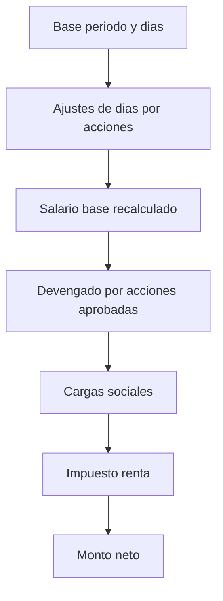

# 🛠️ Manual Tecnico - Operacion por Modulo

## 🎯 Objetivo
Dar a ingenieria una vista unificada de como opera cada modulo y donde tocar cuando hay incidentes.

| Modulo | Backend principal | Frontend principal | Riesgo operativo |
|---|---|---|---|
| Auth/Sesion | `auth.controller.ts`, `auth.service.ts` | `LoginPage`, `useSessionRestore` | Sesiones invalidas/permisos stale |
| Empresas | `companies.controller.ts`, `companies.service.ts` | `CompaniesManagementPage` | Bloqueos por planillas activas |
| Empleados | `employees.controller.ts`, `employees.service.ts`, workflow creacion | `EmployeesListPage`, `EmployeeCreatePage` | Exposicion de datos sensibles |
| Config acceso | `config-access.controller.ts` | `UsersManagementPage`, `RolesManagementPage`, `PermissionsAdminListPage` | Escalada de privilegios |
| Planilla | `payroll.controller.ts`, `payroll.service.ts` | `PayrollGeneratePage`, `OvertimeInlineForm`, `AbsenceInlineForm`, `RetentionInlineForm`, `DiscountInlineForm` | Transiciones de estado invalidas |
| Acciones personal | `personal-actions.controller.ts`, `personal-actions.service.ts` | Paginas por tipo de accion | Consumo incorrecto en nomina |
| Parametros nomina | articulos/movimientos/feriados controllers | paginas payroll params | Configuracion inconsistente |
| Traslado interempresa | `intercompany-transfer.controller.ts` | `IntercompanyTransferPage` | Reasociacion incompleta |

## 🎯 Cadena tecnica end-to-end

## 🔗 Ver tambien
- [Matriz CRUD por modulo](./08-MATRIZ-CRUD-POR-MODULO.md)
- [Manejo de incidentes](./09-MANEJO-INCIDENTES-FUNCIONALES.md)

## 🎯 Regla tecnica critica - Modulo Planilla
- En `payroll.service.ts` el recalc de tabla debe incluir acciones `APPROVED`:
  - no asociadas (`idCalendarioNomina IS NULL`)
  - y asociadas a la planilla actual (`idCalendarioNomina = payroll.id`)

Si no se cumple esta regla, puede pasar este incidente:
- La accion se ve `Aprobada` en el detalle.
- Pero la fila principal del empleado no cambia en bruto/devengado/neto.
- En la tabla de planilla deben mostrarse solo acciones en rango y estado:
  - `Pendiente Supervisor`
  - `Pendiente RRHH`
  - `Aprobada`

## 🧮 Formula tecnica consolidada - Planilla
Flujo de calculo por empleado (orden):

| Campo | Formula tecnica |
|---|---|
| `dias` | `dias_periodo` ajustado por ingreso en periodo, override por renuncia/despido y resta por: ausencia no remunerada, licencia no remunerada, incapacidad, vacaciones. |
| `salarioBrutoPeriodo` | No por horas: `salarioBase * (diasLaborados / 30)`. |
| `totalBruto` | `salarioBrutoPeriodo + ingresosAccionesAprobadas`. |
| `cargasSociales` | `sum(totalBruto * porcentaje_carga_social_activa)`. |
| `impuestoRenta` | Tramos progresivos, menos creditos (`hijos`, `conyuge`), quincenal solo segunda quincena y acumulando base de quincena anterior. |
| `totalDeducciones` | `deduccionesAccionesAprobadas + cargasSociales + impuestoRenta`. |
| `totalNeto` | `totalBruto - totalDeducciones`. |

### 📌 Reglas por tipo de accion aprobada
| Tipo accion | Dias | Monto en devengado |
|---|---|---|
| `ausencia` | Resta solo no remunerada | No suma monto |
| `licencia` | Resta solo no remunerada | Suma solo lineas remuneradas |
| `incapacidad` | Resta dias | Suma solo monto de lineas `CCSS` |
| `vacaciones` | Resta dias | Recalcula monto por dias de vacaciones |
| `aumento` | No afecta dias | Suma monto de lineas |
| `bonificacion` | No afecta dias | Suma monto de lineas |
| `hora_extra` | No afecta dias | Suma monto de lineas |
| `retencion`/`descuento` | No afecta dias | Va a deduccion, no a devengado |

### 🖥️ Formularios inline de acciones
En `PayrollGeneratePage` el selector "Agregar acciones de personal" muestra cuatro formularios inline: Horas extras, Ausencias, Retenciones, Descuentos. Cada uno usa `useTransactionLines`, catalogo de movimientos por tipo y llama `createOvertime`/`createAbsence`/`createRetention`/`createDiscount`. Ver [Planilla Operativa](../13-manual-usuario/05-PLANILLA-OPERATIVA.md).

### 🖥️ UX de trazabilidad en tabla de acciones
En `PayrollGeneratePage` el detalle expandido se simplifica para operacion diaria:
- `Categoria`
- `Tipo de Accion`
- `Como aplica`
- `Estado`
- `Accion`
- `Monto` (ultima columna)

### 🧭 Rutas clave de planilla (router)
- `Listado de Dias de Pago de Planilla`: `/payroll-params/calendario/dias-pago`
- `Listado de Planillas` (alias): `/payroll-management/planillas/listado`
- `Cargar Planilla Regular`: `/payroll-management/planillas/generar`
- `Lista de Planillas Aplicadas`: `/payroll-management/planillas/aplicadas`
- `Distribucion de la planilla`: `/payroll-management/planillas/aplicadas/distribucion/:publicId`

Seguridad de identificador publico:
- `publicId` firmado en backend (`p1_<payload>.<signature>`).
- Endpoint de resolucion: `GET /payroll/public/:publicId`.
- Validacion obligatoria: firma valida + acceso de usuario a `idEmpresa` de la planilla.

Nota tecnica:
- El menu de Parametros de Planilla usa la ruta `/payroll-params/calendario/dias-pago`.
- Debe existir una ruta explicita en `AppRouter.tsx` para evitar que el click del submenu no navegue.

### ? Seleccion persistente de empleados en planilla
- Endpoint: PATCH /payroll/:id/employee-selection con body { employeeIds: number[], selected: boolean }.
- Persistencia: 
omina_empleado_verificado (campos incluido_planilla_empleado, erificado_empleado, 
equiere_revalidacion_empleado).
- Al marcar (selected=true): incluido=1, erificado=1, 
equiere_revalidacion=0.
- Al desmarcar (selected=false): incluido=0, erificado=0, 
equiere_revalidacion=0.

### ? Reglas de calculo/aplicacion por seleccion
- En process se calculan todos para vista, pero los totales y 
omina_resultados solo incluyen empleados marcados.
- erify y pply bloquean si no hay empleados marcados.
- pply consume acciones aprobadas solo de empleados marcados.

### ? Bloqueo de aprobacion tardia
- PATCH /personal-actions/:id/approve acepta payrollId opcional para contexto de planilla.
- Si empleado esta verificado en esa planilla: se bloquea aprobacion.
- PATCH `invalidate*` (ausencias/licencias/incapacidades/bonificaciones/horas extra/retenciones/descuentos/aumentos/vacaciones) tambien bloquea si empleado esta verificado en esa planilla.

- Comportamiento por defecto: sin registro en 
omina_empleado_verificado => empleado NO incluido (checkbox desmarcado).
- UX no bloqueante: seleccion de checkbox aplica optimistic update por empleado; solo se bloquea el checkbox del empleado en proceso, no toda la tabla.
- Creacion de acciones inline dispara refresh en background y muestra hint operativo en detalle de acciones durante submit.

### Contrato UX no bloqueante (estipulado)
Implementacion esperada en `PayrollGeneratePage`:

| Caso | Contrato tecnico |
|---|---|
| Seleccion por checkbox | Actualizacion optimista por fila, persistencia async, sin lock global de tabla |
| Crear accion inline | `create*` primero, cierre de formulario inline, `refreshLoadedPayrollTable` en background |
| Feedback visual | Hint visible en detalle: `Guardando accion de personal y recalculando planilla en segundo plano...` |
| Error de persistencia | Toast/error contextual y rollback o reconciliacion con siguiente refresh |

Notas de ingenieria:
- Evitar estados globales de loading para operaciones por empleado.
- Usar estado de pending por `idEmpleado` para limitar bloqueo a la fila afectada.
- No esperar sincronamente el recalc para devolver control de UI al usuario.
- El resumen monetario debe agregarse solo sobre filas con `seleccionadoPlanilla=true` (con normalizacion defensiva de flags `true/false`, `1/0`, `'1'/'0'`).
- Si `seleccionadoPlanilla && verificadoEmpleado`, la columna de accion de la tabla expandida no debe permitir `Aprobar` ni `Invalidar`.

## Verificar y reabrir planilla (tecnico)
### Verificar (`PATCH /payroll/:id/verify`)
Precondiciones:
- Planilla en `EN_PROCESO`.
- Existe snapshot de empleados.
- Existen inputs o cargas sociales configuradas.
- Existen resultados calculados.
- Hay al menos un empleado incluido.
- Ningun empleado incluido con `requiereRevalidacion=1`.

Persistencia al verificar:
- `nom_calendarios_nomina`: estado -> `VERIFICADA`, `version_lock`++, `modificado_por`.
- Auditoria de accion y evento de dominio.
- No consume acciones en este paso.

### Reabrir (`PATCH /payroll/:id/reopen`)
Precondiciones:
- Solo permitido desde `VERIFICADA`.
- `APLICADA/CONTABILIZADA` no son reabribles.

Persistencia al reabrir:
- `nom_calendarios_nomina`: estado -> `ABIERTA`, `version_lock`++, `modificado_por`.
- Se agrega motivo en `descripcionEvento`.
- Auditoria de accion y evento de dominio.

### Tablas clave para soporte
- `nom_calendarios_nomina` (estado/version/actor).
- `nomina_planilla_snapshot_json` (snapshot integral de planilla).
- `nomina_resultados` (resultado por empleado).
- `nomina_empleado_verificado` (incluido/verificado/revalidacion por empleado).
- `nomina_inputs_snapshot` (inputs de calculo por empleado/accion).

## Vista dedicada: planillas aplicadas
- Ruta nueva: `/payroll-management/planillas/aplicadas`.
- Renderiza `PayrollManagementPage` en modo `applied`.
- Filtros por defecto en estado: `[3, 4, 5]` => Verificada, Aplicada, Enviada NetSuite.
- Sin filtro de `DateRange` en UI y sin envio de `dateFrom/dateTo` al `fetchPayrolls`.
- Texto de cabecera ajustado a finalizacion de proceso.

Control de acceso (OR):
- `payroll:verify` OR `payroll:apply` OR `payroll:netsuite:send` OR `payroll:send_netsuite`.
- Implementado en selector `canAccessAppliedPayrollList` y en menu `requiredAnyPermissions`.
