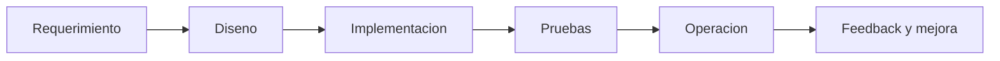

# Manual Tecnico - Operacion por Modulo (Vista Senior)

## Objetivo
Dar a ingenieria una vista unificada de ownership tecnico por modulo y puntos de control.

## Modulos y responsabilidad tecnica
| Modulo | Documento tecnico principal | Riesgo principal | Control clave |
|---|---|---|---|
| Seguridad/Permisos | `../05-seguridad-identidad-permisos/SEGURIDAD-IDENTIDAD-PERMISOS-CONSOLIDADO.md` | Acceso indebido | Doble validacion FE/BE |
| Backend/API/BD | `../06-backend-api-db/BACKEND-API-DB-CONSOLIDADO.md` | Inconsistencia de datos | Validacion DTO + reglas + auditoria |
| Frontend/UX | `../07-frontend-ux/FRONTEND-UX-CONSOLIDADO.md` | Errores operativos de usuario | Validaciones y confirmaciones |
| Planilla | `../08-planilla/PLANILLA-NOMINA-CONSOLIDADO.md` | Errores de cierre y calculo | Estados + inmutabilidad APLICADA |
| Acciones personal | `../09-acciones-personal/ACCIONES-PERSONAL-INDICE.md` | Consumo indebido en nomina | Gate por estado APPROVED |
| QA | `../10-testing-qa/TESTING-QA-CONSOLIDADO.md` | Liberacion sin evidencia | Gate de salida QA |
| Operacion | `../11-operacion-automatizaciones/OPERACION-AUTOMATIZACIONES-CONSOLIDADO.md` | Degradacion silenciosa | Monitoreo y semaforo |

## Flujo tecnico end-to-end

## Ver tambien
- [Stack y arquitectura](./00-STACK-Y-ARQUITECTURA.md)
- [Reglas tecnicas](./01-REGLAS-TECNICAS.md)
- [Pendientes tecnicos](./06-PENDIENTES-TECNICOS.md)
