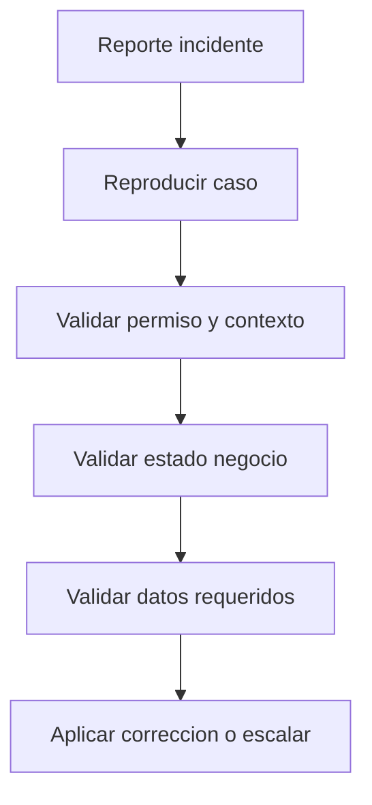

# 🛠️ Manual Tecnico - Manejo de Incidentes Funcionales

## 🎯 Triage inicial
1. Confirmar modulo afectado.
2. Confirmar usuario, empresa activa y app activa.
3. Confirmar permiso requerido y estado del registro.
4. Confirmar regla de negocio que aplica.

## 📊 Tabla de incidentes comunes
| Incidente | Causa probable | Validacion tecnica |
|---|---|---|
| 403 con menu visible | Permiso FE desactualizado o denegacion BE | Revisar `/auth/me`, `/auth/switch-company`, overrides y denegaciones |
| No permite inactivar empresa | Planillas activas bloqueantes | Revisar estados de planilla de la empresa |
| No permite inactivar empleado | Planillas activas o acciones pendientes | Revisar planillas + acciones sin planilla |
| No permite verificar planilla | Sin snapshots o sin resultados | Revisar tablas snapshot/resultados |
| Accion no impacta planilla | Estado no aprobado | Revisar estado de accion y avance |
| Traslado interempresa falla | Destino incompatible | Ejecutar simulacion y revisar bloqueos |

## 🔄 Flujo de diagnostico

## 🎯 Criterios de escalamiento
Escalar a ingenieria cuando:
- El permiso efectivo es correcto pero API falla sin causa funcional.
- La transicion de estado falla en un caso valido.
- Se detecta inconsistencia entre UI y API no explicable por cache/sesion.

## 🔗 Ver tambien
- [Runbooks operativos](../16-enterprise-operacion/04-RUNBOOKS-OPERATIVOS.md)
- [Playbook incidentes](../16-enterprise-operacion/05-PLAYBOOK-INCIDENTES.md)

