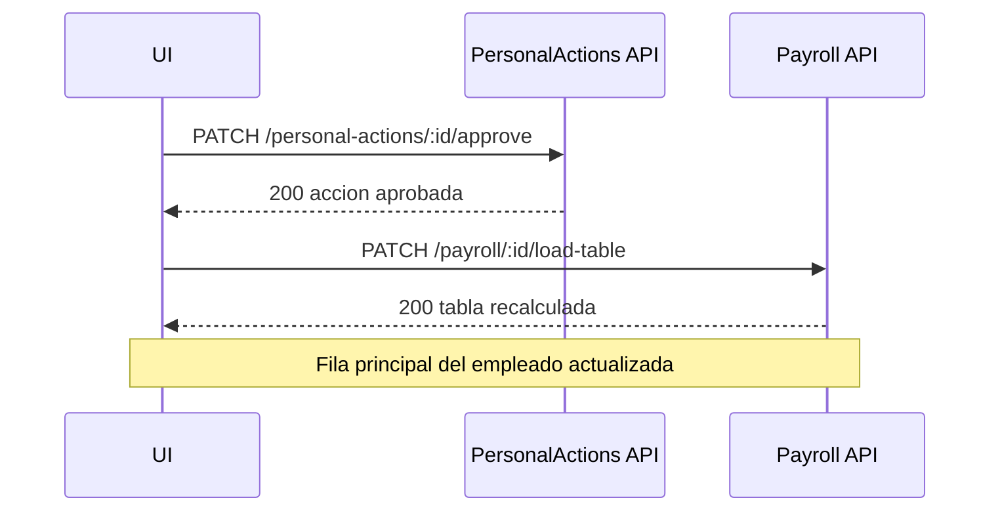

# ⚙️ Catalogo API Funcional

## 🎯 Objetivo
Concentrar endpoints, permisos y contratos funcionales.

## 🎯 Formato de respuesta canonico
```json
{
  "success": true,
  "data": {},
  "message": "Operacion completada",
  "error": null
}
```

## 🎯 Endpoints clave
| Modulo | Endpoint | Metodo | Permiso | Exito | Errores comunes |
|---|---|---|---|---|---|
| Auth | /auth/login | POST | publico | 200 | 401 |
| Empleados | /employees | POST | employee:create | 201 | 400, 409 |
| Empleados | /employees/:id | GET | employee:view | 200 | 404 |
| Empresas | /companies | POST | company:manage | 201 | 400, 409 |
| Planilla | /payroll/:id/load-table | PATCH | payroll:process | 200 | 400, 403 |
| Planilla | /payroll/:id/apply | PATCH | payroll:apply | 200 | 400, 409 |
| Acciones | /personal-actions/:id/approve | PATCH | hr_action:approve | 200 | 400, 403 |
| Acciones | /personal-actions/horas-extras | POST | hr-action-horas-extras:create | 201 | 400, 403 |
| Acciones | /personal-actions/ausencias | POST | hr-action-ausencias:create | 201 | 400, 403 |
| Acciones | /personal-actions/retenciones | POST | hr-action-retenciones:create | 201 | 400, 403 |
| Acciones | /personal-actions/descuentos | POST | hr-action-descuentos:create | 201 | 400, 403 |

## 🔄 Secuencia funcional - crear accion desde planilla
Al usar formularios inline (Horas extras, Ausencias, Retenciones, Descuentos) en `PayrollGeneratePage`:
1. UI llama POST al endpoint correspondiente con `idEmpresa`, `idEmpleado`, `lines`.
2. Backend crea la accion en estado `PENDING_SUPERVISOR`.
3. UI recarga tabla de planilla; la accion aparece en el detalle del empleado.
4. Usuario aprueba desde el detalle o luego.

## 🔄 Secuencia funcional - aprobar accion en carga de planilla


Regla operativa:
- `load-table` muestra acciones dentro del rango de la planilla con estado pendiente/aprobada.
- La accion solo impacta montos cuando ya esta `Aprobada`.

## 🎯 Regla
- Todo endpoint productivo debe estar documentado aquí antes de release.


